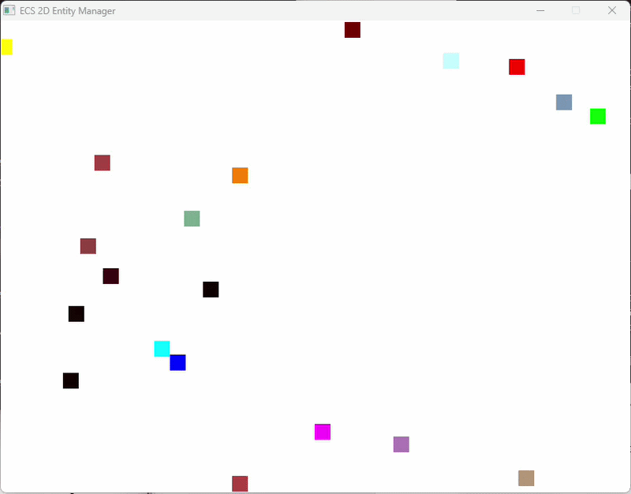

# ECS架构2D实体碰撞系统
一个基于**ECS（实体-组件-系统）架构**实现的极简2D实体管理+碰撞演示程序，使用C++ + SDL2开发，包含实体创建、移动、渲染、精准碰撞反弹等核心功能。

## 项目简介
ECS是游戏开发中主流的架构模式，核心思想是「数据与逻辑分离」：
- **实体（Entity）**：仅作为唯一ID，无任何逻辑/数据；
- **组件（Component）**：纯数据结构，仅存储状态（如位置、速度、碰撞盒）；
- **系统（System）**：纯逻辑代码，处理拥有特定组件的实体（如移动系统、碰撞系统）。

本项目通过一个可视化的2D矩形碰撞Demo，完整实现ECS架构的核心设计，并解决了碰撞检测中常见的「穿透、卡顿、反弹不自然」问题。

## 核心功能
✅ **ECS核心模块**
- EntityManager：统一管理实体的创建、销毁，以及组件的挂载/获取/检测；
- 纯数据组件：Position（位置）、Velocity（速度）、Collision（碰撞盒）、Render（渲染属性）。

✅ **系统模块**
- MovementSystem：处理实体移动逻辑，实现窗口边缘碰撞反弹；
- RenderSystem：基于SDL2渲染彩色矩形实体，黑色背景；
- CollisionSystem：AABB轴对齐包围盒碰撞检测，支持：
  - 碰撞重叠深度计算；
  - 碰撞方向判断（水平/垂直）；
  - 最小移动量修正（MMR），解决实体穿透/卡顿；
  - 方向化反弹（水平碰仅反转X速度，垂直碰仅反转Y速度）；
  - 可选摩擦系数，避免无限反弹。

✅ **编译兼容**
- 兼容C++11及以上版本，无C++17特性依赖；
- 修复指针访问、函数作用域、链接器等常见编译错误。

## 环境依赖
- 编译器：MinGW/GCC（推荐11.0+）、MSVC等支持C++11的编译器；
- 图形库：SDL2（需配置SDL2头文件和链接库）；
- 构建工具：CMake（3.10+）。

## 快速开始
### 1. 环境配置
确保本地已安装SDL2，并配置好环境变量（或在CMakeLists.txt中指定SDL2路径）。

### 2. 编译运行
```bash
# 克隆项目（替换为你的仓库地址）
git clone https://github.com/你的用户名/ecs-2d-collision.git
cd ecs-2d-collision

# 构建项目
mkdir build && cd build
cmake .. -G "MinGW Makefiles"
mingw32-make

# 运行程序
./ecs-entity-manager.exe
```
### 3. 效果演示
运行后会弹出 800x600 的窗口，20 个不同颜色的矩形实体随机移动：
实体碰撞窗口边缘会反弹；
实体之间碰撞会精准分离并沿碰撞方向反弹；
无穿透、无卡顿，碰撞效果符合物理直觉。


## 代码结构
```bash
├── include/
│   └── ecs/
│       ├── EntityManager.h    # ECS核心：实体/组件管理
│       ├── Component.h        # 纯数据组件定义
│       ├── System.h           # 系统基类+移动/渲染系统声明
│       └── CollisionSystem.h  # 碰撞系统声明+碰撞组件
├── src/
│   ├── ecs/
│   │   ├── EntityManager.cpp  # （已移除，所有实现移至头文件）
│   │   ├── Component.cpp      # 组件相关辅助实现
│   │   ├── System.cpp         # 移动/渲染系统实现
│   │   └── CollisionSystem.cpp # 碰撞系统核心实现
│   ├── renderer/
│   │   └── SDLRenderer.cpp    # SDL渲染辅助代码
│   └── main.cpp               # 程序入口：初始化+主循环
├── CMakeLists.txt             # CMake构建配置
└── README.md                  # 项目说明
```
## 核心技术点
### 1. AABB 碰撞检测
```bash
// 核心判断逻辑
return (pos1->x < pos2->x + col2->width) &&
       (pos1->x + col1->width > pos2->x) &&
       (pos1->y < pos2->y + col2->height) &&
       (pos1->y + col1->height > pos2->y);
```
### 2. 碰撞重叠深度计算
通过计算两个实体的中心点和半宽 / 半高，得到 X/Y 方向的重叠像素数，用于精准分离实体：
```bash
float x_overlap = e1_half_w + e2_half_w - abs(e1_center_x - e2_center_x);
float y_overlap = e1_half_h + e2_half_h - abs(e1_center_y - e2_center_y);
```

### 3. 最小移动量修正（MMR）
根据重叠深度，将碰撞的两个实体沿碰撞方向推开，彻底解决穿透问题：
```bash
float push_amount = x_overlap / 2.0f;
if (pos1->x < pos2->x) {
    pos1->x -= push_amount;
    pos2->x += push_amount;
} else {
    pos1->x += push_amount;
    pos2->x -= push_amount;
}
```